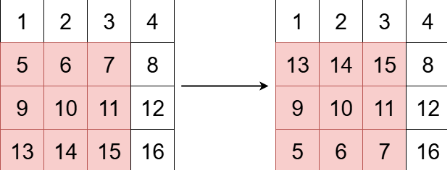
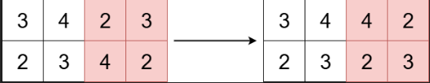

# Problem

You are given an m x n integer matrix grid, and three integers x, y, and k.

The integers x and y represent the row and column indices of the top-left corner of a square submatrix and the integer k represents the size (side length) of the square submatrix.

Your task is to flip the submatrix by reversing the order of its rows vertically.

Return the updated matrix.

## Example


```text
Input: 
grid = [[1,2,3,4],[5,6,7,8],[9,10,11,12],[13,14,15,16]]
x = 1, y = 0, k = 3

Output: [[1,2,3,4],[13,14,15,8],[9,10,11,12],[5,6,7,16]]
```



```text
Input: 
grid = [[3,4,2,3],[2,3,4,2]]
x = 0, y = 2, k = 2

Output: [[3,4,4,2],[2,3,2,3]]

```
## Approach

First of all you know basically from where it starts and at where it is going to end because we have already given x and y.

Now swap the first and last row elements sequentially.

So you can consider like Start row, End row, Start column and End column, like,
```text
int sc = y;
int ec = y + k - 1;
int sr = x;
int er = x + k - 1;
```

Then using nested loops, swap like
```cpp
swap(grid[i][j], grid[er][j])
```
#### or using third var

```java
int temp = grid[i][j];
grid[i][j] = grid[er][j];
grid[er][j] = temp;
```

Then in each iteration i is going to going to update for the next row & we will update End row or er for previous row.

At last of iterations, we will have our answer and return the grid.


## Solution

```java
class Solution {
    public int[][] reverseSubmatrix(int[][] grid, int x, int y, int k) {
        int sc = y;
        int ec = y + k - 1;
        int sr = x;
        int er = x + k - 1;

        for(int i = sr; i <= er; i++){
            for(int j = sc; j <= ec; j++){
                int temp = grid[i][j];
                grid[i][j] = grid[er][j];
                grid[er][j] = temp;
            }
            er--;
        }
        return grid;
    }
}
```

## Complexity

```text
Time: O(k * k) Because we are iterating only i till k

Space: O(1)

```

## Key Takeaway

The main idea is to take the top row and swap it with the bottom row, then move inward row by row.

You’re just reversing rows within that window, not changing column order.